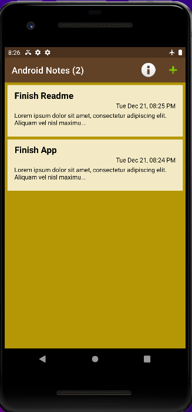
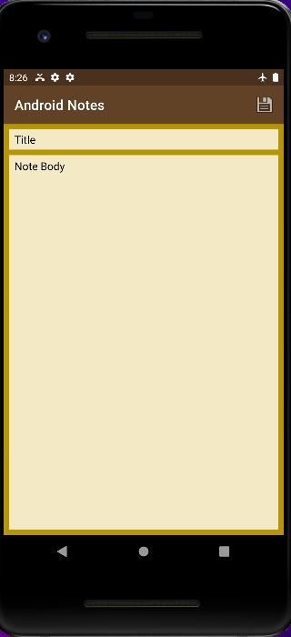
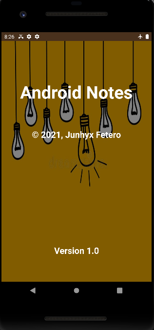

# android-notes-app
Android Notes application built for my CS 442 - Mobile Application Development course

## Activities

### Main Activity

* Stores notes in chronological order of when made/updated
* Shows the number of total notes in the title header
* Uses Recycler views to show notes
* Uses onClickListeners to be able to edit the note when short pressed and delete the note when long pressed
* Access the other activities using menu items 

### Edit Activity

* Can be accessed by clicking on a note to edit note or clicking the plus icon to create new note
* Uses alert dialogs to warn user about not having title or not saving before exiting activity

### About Activity

* Just an extra activity for the assignment

# What I Learend
* Recycler views and using onClickListeners for extra functions
* Using Menus and menu items
* Using Intents to be able to switch between activities and pass along data
* Using Dialogs to alert or send message to user

